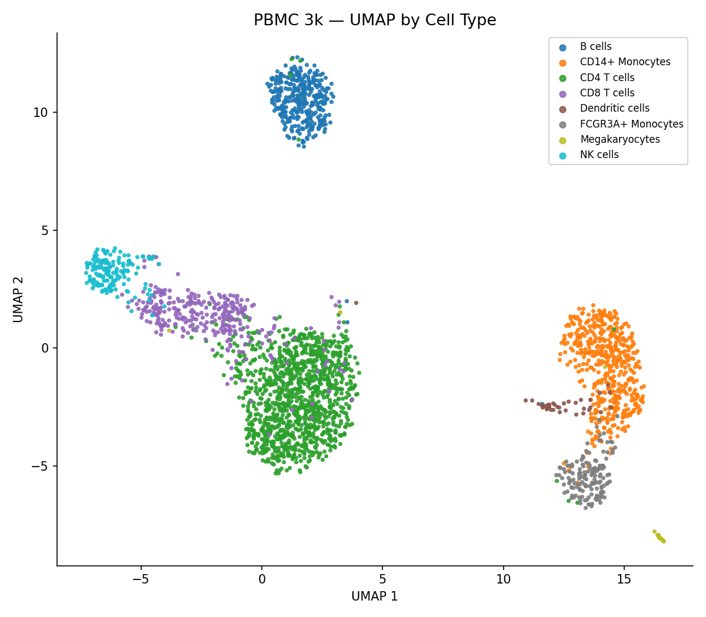

# OpenBioOps — BioTech Data Platform Demo

A full-stack bioinformatics platform demonstrating an end-to-end single-cell RNA-seq analysis pipeline, from raw counts to ML-powered run similarity search.

*UMAP of 2,638 PBMCs from the 10x Genomics PBMC 3k dataset, colored by cell type. Produced by the OpenBioOps feature extraction pipeline.*

---

## What it does

1. **Ingests** raw scRNA-seq count matrices via a Nextflow (or WDL) pipeline
2. **Processes** them through normalization → HVG selection → PCA using scanpy
3. **Trains** a contrastive encoder (NT-Xent loss, dropout augmentation) to embed runs into a shared latent space
4. **Indexes** run-level embeddings for cosine similarity search via a FastAPI backend
5. **Visualizes** results through a React dashboard

---

## Architecture

┌─────────────────────────────────────────────────────┐
│                    Client / Browser                 │
│              React Dashboard  (port 3000)           │
└──────────────────────┬──────────────────────────────┘
                       │ REST
┌──────────────────────▼──────────────────────────────┐
│              FastAPI  (port 8000)                   │
│   /runs  /similarity  /compute_vector  /token       │
└──────┬──────────────────────────┬───────────────────┘
       │ SQLite (dev)             │ in-memory index
       │ Postgres (prod)          │ (faiss in prod)
┌──────▼───────┐        ┌────────▼───────────────────┐
│  Run Store   │        │  RunSimilarityIndex        │
│  (SQLAlchemy)│        │  (cosine, NT-Xent trained) │
└──────────────┘        └────────────────────────────┘

┌──────────────────────────────────────────────────────┐
│                 Nextflow / WDL Pipeline              │
│  QC → Quantify → ExtractFeatures (scanpy/PCA)        │
│  → embeddings.parquet                                │
└──────────────────────┬───────────────────────────────┘
                       │
┌──────────────────────▼───────────────────────────────┐
│                  ML (PyTorch)                        │
│  ContrastiveEncoder — NT-Xent + dropout augmentation │
│  train.py → model.pt                                 │
│  inference.py → embeddings.parquet                   │
│  Experiment tracking: MLflow                         │
└──────────────────────────────────────────────────────┘


## Quick start

```bash
git clone https://github.com/SethJoslin/BioTechDemo
cd BioTechDemo
docker compose up          # API on :8000, dashboard on :3000
```

## Project layout

| Directory | Description |
|-----------|-------------|
| `services/api` | FastAPI backend: run management & similarity search |
| `services/dashboard` | React frontend |
| `ml/` | PyTorch contrastive encoder: train, infer, visualize, evaluate |
| `pipelines/main.nf` | Nextflow DSL2 pipeline (QC → quant → feature extraction) |
| `pipelines/workflow.wdl` | WDL equivalent for DNAnexus / Terra |
| `infra/terraform` | AWS EKS + VPC provisioning |
| `infra/k8s` | Kubernetes manifests |
| `snowflake/` | Snowflake schema and loader stubs |

## ML model

The contrastive encoder maps variable-length PCA embeddings (50 PCs) into a fixed 64-dimensional latent space using NT-Xent loss. Augmentation uses simulated dropout to mimic the technical variability inherent in scRNA-seq data rather than generic Gaussian noise.

Evaluated on 10x PBMC 3k (8 cell types):

| Metric | Value |
|--------|-------|
| k-NN accuracy (k=10) | 62.1% |
| Silhouette score | -0.003 |
| Random baseline | 12.5% |

The near-zero silhouette reflects genuine biological overlap between cell types (CD4/CD8 T cells share most of their transcriptome) rather than model failure.

## API

```bash
# Create a run
curl -X POST http://localhost:8000/runs \
  -H "Content-Type: application/json" \
  -d '{"name": "sample-A", "metadata": {"tissue": "lung"}}'

# Index its embedding vector
curl -X POST http://localhost:8000/runs/{run_id}/compute_vector

# Find similar runs
curl http://localhost:8000/similarity/{run_id}?k=5
```

Full interactive docs at http://localhost:8000/docs.

## Stack

Python · FastAPI · SQLAlchemy · PyTorch · scanpy · Nextflow · WDL · Terraform (AWS EKS) · Kubernetes · React · MLflow · Docker

## TODO

- [ ] Flesh out Snowflake schema and loader
- [ ] Use real scRNA-seq datasource (e.g. 10x PBMC 3k), or other
- [ ] Swap in-memory similarity index for FAISS
- [ ] Swap SQLite for Postgres in production
- [ ] Add async job queue (Celery / ARQ) so pipeline triggers don't block
- [ ] Add real QC metrics: mito %, doublet detection (scrublet)
- [ ] Add Cell Ranger / STARsolo quantification option
- [ ] Add more robust ML Operations