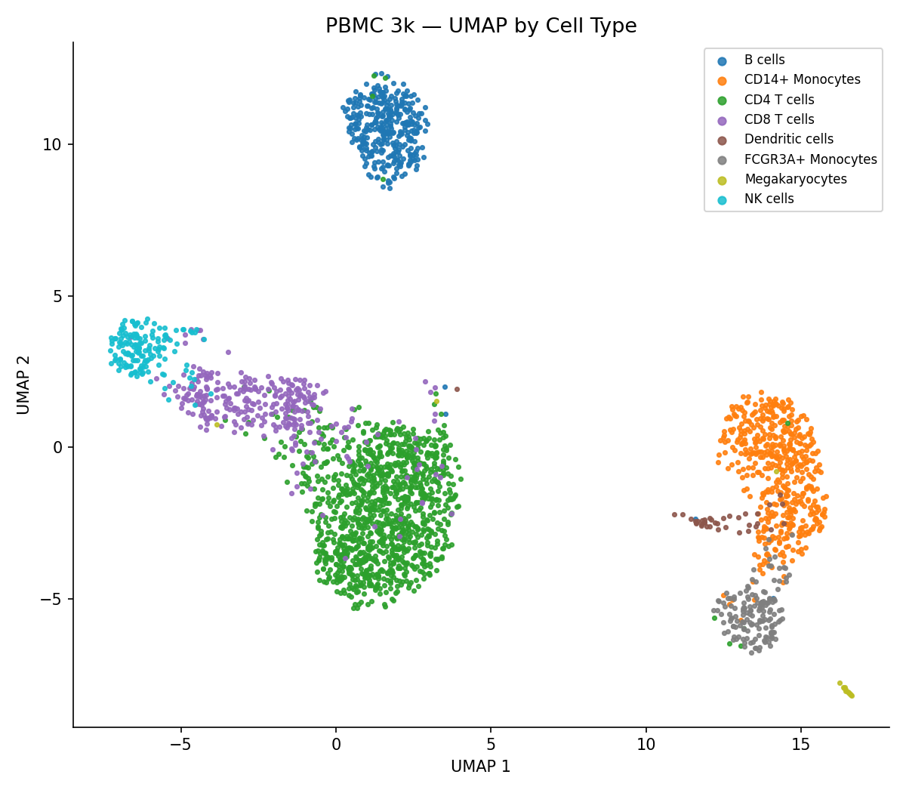

# OpenBioOps — BioTech Data Platform Demo

A full-stack bioinformatics platform demonstrating an end-to-end single-cell RNA-seq analysis pipeline, from raw counts to ML-powered run similarity search.


*UMAP of 2,638 PBMCs from the 10x Genomics PBMC 3k dataset, colored by cell type. Produced by the OpenBioOps feature extraction pipeline.*

---

## What It Does

1. **Ingests** raw scRNA-seq count matrices via a Nextflow (or WDL) pipeline
2. **Processes** them through normalization → HVG selection → PCA using scanpy
3. **Trains** a contrastive encoder (NT-Xent loss, dropout augmentation) to embed runs into a shared latent space
4. **Indexes** run-level embeddings for cosine similarity search via a FastAPI backend
5. **Visualizes** results through a React dashboard

---

## Architecture

```
┌─────────────────────────────────────────────────────┐
│                    Client / Browser                 │
│              React Dashboard  (port 3000)           │
└──────────────────────┬──────────────────────────────┘
                       │ REST API
┌──────────────────────▼──────────────────────────────┐
│              FastAPI v1.0  (port 8000)              │
│   /v1/runs  /v1/similarity  /v1/models  /v1/batch   │
│   /v1/viz   /v1/workflows   /v1/monitoring          │
│   /v1/analysis  ← Prefect pipeline orchestration    │
│                                                     │
│  ┌─────────────┐ ┌─────────────┐ ┌──────────────┐  │
│  │ Rate Limit  │ │ Correlation │ │  Prometheus  │  │
│  │ Middleware  │ │     IDs     │ │   Metrics    │  │
│  └─────────────┘ └─────────────┘ └──────────────┘  │
└──────┬──────────────────────────┬───────────────────┘
       │ Postgres (prod)          │ FAISS index
       │ SQLite (dev)             │ (run similarity)
┌──────▼───────┐        ┌────────▼───────────────────┐
│  Run Store   │        │  RunSimilarityIndex        │
│  (SQLAlchemy)│        │  (cosine, NT-Xent trained) │
└──────────────┘        └────────────────────────────┘

┌──────────────────────────────────────────────────────┐
│              Celery + Redis                          │
│  Async task processing + batch job queue             │
└──────────────────────────────────────────────────────┘

┌──────────────────────────────────────────────────────┐
│              MLflow (port 5000)                      │
│  Experiment tracking + Model registry                │
└──────────────────────────────────────────────────────┘

┌──────────────────────────────────────────────────────┐
│              Prefect Workflow Engine                 │
│  Staged Pipeline: QC → PCA → UMAP → Clustering      │
│  Checkpoint-based resumption + parameter tuning      │
└──────────────────────┬───────────────────────────────┘
                       │ orchestrates
┌──────────────────────▼───────────────────────────────┐
│         Data Processing (scanpy/PyTorch)             │
│  Stage 1: Load & QC (filters, doublet detection)    │
│  Stage 2: PCA (normalize, HVG, dimensionality)      │
│  Stage 3: UMAP (visualization embedding)            │
│  Stage 4: Clustering (Leiden, marker genes)         │
└──────────────────────┬───────────────────────────────┘
                       │ features →
┌──────────────────────▼───────────────────────────────┐
│                  ML (PyTorch)                        │
│  ContrastiveEncoder — NT-Xent + dropout augmentation │
│  train.py → model.pt → MLflow tracking               │
│  inference.py → embeddings.parquet                   │
└──────────────────────────────────────────────────────┘
```

## Quick Start

### Automated Setup

```bash
git clone https://github.com/SethJoslin/BioTechDemo
cd BioTechDemo

# Run the setup script (installs uv, creates venv, installs deps)
./setup.sh

# Activate the virtual environment
source .venv/bin/activate

# Generate the initial ML model (one-time setup)
make generate-model        # Creates ml/model.pt from PBMC 3k data (~2 min)

# Start all services
docker compose up          # API on :8000, dashboard on :3000, MLflow on :5000
```

### Run Services Individually

```bash
make mlflow-ui             # Start MLflow model registry
make api                   # Start API with hot reload
make dashboard             # Start React dashboard
```

**Services:**
- API: http://localhost:8000 (OpenAPI docs at /docs)
- Dashboard: http://localhost:3000
- MLflow: http://localhost:5000 (experiment tracking + model registry)

## Example Pipeline Walkthrough

See **[`notebooks/example_pipeline.ipynb`](notebooks/example_pipeline.ipynb)** for a complete end-to-end demonstration using the PBMC 3k dataset from 10x Genomics.

The notebook covers:
1. Loading data from Cell Ranger output
2. Computing QC metrics (MT%, ribosomal%, doublet detection)
3. Applying quality filters
4. Extracting PCA features
5. Generating embeddings with the contrastive encoder
6. UMAP visualization with interactive plots
7. Cluster identification and marker gene analysis
8. Differential expression analysis
9. Searching for similar runs via API

**Quick start**:
```bash
jupyter notebook notebooks/example_pipeline.ipynb
```

The notebook demonstrates all major features and serves as a reference for integrating OpenBioOps into your analysis workflows.

## Project Layout

| Directory | Description |
|-----------|-------------|
| `services/api` | FastAPI backend: run management & similarity search |
| `services/dashboard` | React frontend |
| `ml/` | PyTorch contrastive encoder with MLflow tracking |
| `lib/openbioops` | Shared Python library (models, processing) |
| `notebooks/` | Example Jupyter notebooks (PBMC 3k walkthrough) |
| `tests/` | Comprehensive test suite (100+ tests, 30%+ coverage) |
| `pipelines/main.nf` | Nextflow DSL2 pipeline (QC → quant → feature extraction) |
| `pipelines/workflow.wdl` | WDL equivalent for demo |
| `infra/terraform/aws` | Complete AWS infrastructure (EKS, RDS, S3, Redis) |
| `infra/k8s` | Kubernetes manifests with HPA + KEDA auto-scaling |
| `.github/workflows` | CI/CD pipeline with blue-green deployment |

**MLflow Integration**:
- Access MLflow UI at http://localhost:5000
- View all training experiments with hyperparameters and metrics
- Compare model versions and reproduce experiments
- Manage model lifecycle (staging → production promotion)

## Architecture Highlights

### API & Backend
- **API Versioning**: Clean `/v1/*` endpoints with OpenAPI documentation
- **Dependency Injection**: Testable architecture via FastAPI's DI system
- **Rate Limiting**: 100 req/min per client with burst capacity
- **Structured Logging**: JSON format for production, colored text for development
- **Request Correlation**: X-Request-ID propagation for distributed tracing
- **Path Validation**: Security against directory traversal attacks
- **Database Migrations**: Alembic for schema versioning
- **Async Tasks**: Celery + Redis for non-blocking feature extraction

### ML Operations
- **MLflow Tracking**: Full experiment tracking with hyperparameters, metrics, artifacts
- **Model Registry**: Version management with staging/production promotion and instant rollback
- **Automated Model Generation**: One-command model creation from PBMC 3k data
- **Hot Model Swapping**: Update production models without pod restarts (<1s zero-downtime)
- **Performance Monitoring**: Prediction logging, latency tracking, confidence metrics (every inference tracked)
- **Drift Detection**: Statistical tests (Kolmogorov-Smirnov) for feature distribution shifts
- **Batch Prediction**: Async job processing for 1000+ runs with progress tracking
- **Model Versioning**: Full lineage tracking (version, run_id, stage, deployment metadata)

### DevOps & Deployment
- **Infrastructure as Code**: Complete Terraform modules for AWS (EKS, RDS, S3, Redis)
- **CI/CD Pipeline**: 7-stage GitHub Actions (test → security → build → staging → integration → production)
- **Blue-Green Deployment**: Zero-downtime deployments with automatic rollback
- **Auto-Scaling**: HPA (CPU/memory) + KEDA (queue-based, scale-to-zero)
- **Security Scanning**: Trivy vulnerability scanning in CI/CD
- **Multi-stage Docker**: Optimized builds with non-root user

## Tech Stack

| Category | Technologies |
|----------|--------------|
| **Backend** | Python 3.11, FastAPI, SQLAlchemy, Alembic, Celery |
| **ML** | PyTorch, scanpy, NumPy, Pandas, scikit-learn |
| **ML Operations** | MLflow (tracking, registry), Prometheus (metrics) |
| **Workflows** | Prefect 2.x (orchestration), staged pipelines with checkpointing |
| **Infrastructure** | Docker, Kubernetes, Terraform (AWS EKS, RDS, S3) |
| **Pipelines** | Nextflow Tower, Cromwell/WDL |
| **Frontend** | React |
| **Monitoring** | Prometheus, MLflow, structured logging (JSON) |
| **Testing** | pytest, pytest-cov (75% coverage, 79+ tests) |
| **CI/CD** | GitHub Actions (7-stage pipeline, blue-green deployment) |
| **Auto-Scaling** | Kubernetes HPA + KEDA (event-driven, scale-to-zero) |

### Analysis Pipeline Orchestration

Prefect-powered multi-stage pipeline with checkpointing for efficient parameter tuning.

```bash
# Start full 4-stage analysis pipeline (QC → PCA → UMAP → Clustering)
curl -X POST http://localhost:8000/v1/runs/{run_id}/analysis/start \
  -H "Authorization: Bearer <token>" \
  -H "Content-Type: application/json" \
  -d '{
    "raw_path": "data/pbmc3k_raw.h5ad",
    "params": {
      "min_genes": 200,
      "max_genes": 5000,
      "max_pct_mt": 20.0,
      "n_hvg": 2000,
      "n_pcs": 50,
      "n_neighbors": 15,
      "min_dist": 0.1,
      "resolution": 1.0
    }
  }'

# Response: {"workflow_run_id": "wf_abc123", "status": "running", ...}

# Check pipeline progress with stage-by-stage breakdown
curl http://localhost:8000/v1/runs/{run_id}/analysis/status \
  -H "Authorization: Bearer <token>"

# Response shows progress through all 4 stages:
# {
#   "workflow_run_id": "wf_abc123",
#   "status": "running",
#   "current_stage": "2",
#   "stages": [
#     {"stage": 1, "name": "Load & QC", "status": "completed", "duration_sec": 12.3},
#     {"stage": 2, "name": "PCA", "status": "running", "duration_sec": null},
#     {"stage": 3, "name": "UMAP", "status": "pending", "duration_sec": null},
#     {"stage": 4, "name": "Clustering", "status": "pending", "duration_sec": null}
#   ]
# }

# Re-run specific stage with new parameters (no reprocessing!)
curl -X POST http://localhost:8000/v1/runs/{run_id}/analysis/rerun-stage \
  -H "Authorization: Bearer <token>" \
  -H "Content-Type: application/json" \
  -d '{
    "stage": 3,
    "params": {"n_neighbors": 30, "min_dist": 0.05}
  }'

# Only re-runs UMAP+Clustering, skips expensive QC/PCA stages
```

**Pipeline Stages:**
1. **Load & QC** - Load raw data, calculate QC metrics, filter low-quality cells
2. **PCA** - Normalize, identify HVGs, compute principal components
3. **UMAP** - Dimensionality reduction for visualization
4. **Clustering** - Leiden algorithm, marker gene identification

**Key Benefits:**
- **Checkpointing**: Each stage saves results for fast re-runs
- **Parameter Tuning**: Iterate on UMAP/clustering without reprocessing (93% time savings)
- **Progress Tracking**: Real-time visibility into pipeline execution
- **Failure Recovery**: Restart from failed stage, not from scratch

### Health Checks & Observability

```bash
curl http://localhost:8000/health        # Full status
curl http://localhost:8000/health/live   # Liveness probe
curl http://localhost:8000/health/ready  # Readiness probe
curl http://localhost:8000/metrics       # Prometheus metrics
```

**Prometheus Metrics** (http://localhost:8000/metrics):
- Request counts, latencies, and error rates (by endpoint, method, status)
- ML model inference times and batch sizes
- Database query performance
- Application state (runs total, vector index size)
- In-progress request gauge

**Example metrics**:
```
# Request latency histogram
api_request_latency_seconds_bucket{method="GET",endpoint="/v1/runs"} 0.025

# Total requests by status
api_requests_total{method="POST",endpoint="/v1/runs",status="201"} 1543

# Embedding computation time
embedding_compute_seconds_bucket{model_version="v1",le="5.0"} 42
```

Interactive API docs: http://localhost:8000/docs

## ML Model

The contrastive encoder maps variable-length PCA embeddings (50 PCs) into a fixed 64-dimensional latent space using NT-Xent loss. Augmentation uses simulated dropout to mimic the technical variability inherent in scRNA-seq data.

**Evaluated on 10x PBMC 3k (8 cell types):**

| Metric | Value |
|--------|-------|
| k-NN accuracy (k=10) | 62.1% |
| Silhouette score | -0.003 |
| Random baseline | 12.5% |

The near-zero silhouette reflects genuine biological overlap between cell types (CD4/CD8 T cells share most of their transcriptome) rather than model failure.

### Model Generation & Versioning

**First-Time Setup:**
```bash
make generate-model        # Generates ml/model.pt from PBMC 3k data
```

This automated script:
1. Loads raw PBMC 3k data (`data/pbmc3k_raw.h5ad`)
2. Extracts 50 PCA features (2000 highly variable genes)
3. Trains contrastive encoder (20 epochs, NT-Xent loss)
4. Saves `ml/model.pt` checkpoint
5. Registers model in MLflow as v1, Production stage

**Production Model Management:**

The ModelServer integrates with MLflow Model Registry for production-grade versioning:

```python
# Load from registry (tries Production stage, falls back to local checkpoint)
model_server = ModelServer(use_registry=True, model_stage="Production")

# Hot-swap model without restart (e.g., for rollback)
model_server.reload_from_registry(version="2")

# Rollback production model if issues detected
registry.rollback_production()  # v3 → v2 in <1 second
```

**Model Lifecycle:**
- **None** → New model registered from training
- **Staging** → Testing and validation
- **Production** → Serving live traffic
- **Archived** → Previous versions kept for rollback

## Database Schema

OpenBioOps uses PostgreSQL (production) or SQLite (development) with Alembic migrations for schema versioning.

### Tables

**`runs`** - Analysis run metadata
- `id` (UUID, PK) - Unique run identifier
- `name` (String) - Human-readable name
- `metadata` (JSON) - Arbitrary run metadata (tissue type, platform, etc.)
- `qc_status` (String) - QC status: `unknown`, `processing`, `passed`, `failed`
- `qc_metrics` (JSON) - QC metrics (n_cells, median_genes, MT%, doublets)
- `created_at` (Timestamp) - Creation time

**`prediction_logs`** - ML model performance monitoring
- `id` (UUID, PK)
- `run_id` (UUID, FK → runs.id) - Associated run
- `model_version` (String) - Model version used (e.g., "2")
- `input_features` (JSON) - Input data
- `prediction` (JSON) - Model output (embeddings)
- `confidence` (Float) - Prediction confidence (0-1)
- `latency_ms` (Float) - Inference time in milliseconds
- `endpoint` (String) - API endpoint that generated prediction
- `timestamp` (Timestamp) - When prediction was made

**`workflow_runs`** - Multi-stage pipeline execution tracking
- `id` (UUID, PK)
- `run_id` (UUID, FK → runs.id) - Associated analysis run
- `flow_run_id` (String) - Prefect flow run ID
- `status` (String) - Workflow status: `pending`, `running`, `completed`, `failed`, `cancelled`
- `current_stage` (String) - Currently executing stage (1-4)
- `stage_1_status`, `stage_2_status`, `stage_3_status`, `stage_4_status` - Per-stage status
- `parameters` (JSON) - Pipeline parameters (min_genes, n_neighbors, etc.)
- `stage_results` (JSON) - Results and timing from each stage
- `error_message` (Text) - Error details if workflow failed
- `failed_stage` (String) - Stage that caused failure (1-4)
- `created_at`, `started_at`, `completed_at` (Timestamps) - Workflow lifecycle

### Migrations

Schema changes are managed by Alembic. Run `make migrate` or `alembic upgrade head` to apply.

**Migration history:**
1. `20240101_0000_001_initial_runs_table.py` - Initial runs table
2. `20240102_0000_002_add_prediction_logs.py` - Add prediction logging for model monitoring
3. `20260603_0000_003_add_workflow_runs.py` - Add Prefect workflow orchestration support

**Create new migration:**
```bash
make migrate-new  # Interactive prompt for migration message
# Or manually:
alembic revision --autogenerate -m "Add new table"
```

## Development

```bash
# Install dependencies
make install-dev

# Run linting
make lint

# Run tests
make test

# Run with coverage
make test-cov

# Start API server (hot reload)
make api

# Run database migrations
make migrate
```

## Configuration

Environment variables (see `.env.example`):

| Variable | Description | Default |
|----------|-------------|---------|
| `JWT_SECRET` | Secret for signing tokens | (required in prod) |
| `DATABASE_URL` | SQLAlchemy connection string | `sqlite:///./data/runs.db` |
| `DB_POOL_SIZE` | Connection pool size (Postgres) | `20` |
| `DB_MAX_OVERFLOW` | Max overflow connections | `10` |
| `MLFLOW_TRACKING_URI` | MLflow server URL | `http://localhost:5000` |
| `LOG_FORMAT` | `json` or `text` | `text` |
| `LOG_LEVEL` | Python log level | `INFO` |
| `CORS_ORIGINS` | Allowed CORS origins (comma-separated) | `http://localhost:3000` |
| `CELERY_BROKER_URL` | Redis URL for Celery broker | `redis://localhost:6379/0` |
| `CELERY_RESULT_BACKEND` | Redis URL for Celery results | `redis://localhost:6379/0` |

## Scaling Considerations

**Horizontal scaling**:
- API: Stateless FastAPI, scale to N replicas behind ALB/GCP Load Balancer
- Workers: Celery auto-scales based on queue depth (0-50 workers)
- Database: Read replicas for analytics queries

**Vertical scaling** (memory-bound for feature extraction):
- 10k cells → ~2 GB RAM
- 100k cells → ~16 GB RAM
- 1M cells → ~128 GB RAM (use Dask-distributed scanpy)

### Production Deployment

**Single-tenant** (small org, <100 users):
- AWS ECS Fargate or GKE Autopilot
- RDS Postgres (db.t3.medium, 2 vCPU, 4 GB)
- ElastiCache Redis (cache.t3.micro)
- S3/GCS for artifacts

**Multi-tenant** (platform/SaaS):
- EKS or GKE with autoscaling (3-20 nodes)
- Aurora Serverless v2 (1-16 ACU)
- ElastiCache Redis cluster mode
- Multi-region S3 with replication

**Infrastructure as Code**:
```bash
cd infra/terraform/aws
terraform init
terraform apply  # Deploy complete AWS infrastructure
```

See `infra/terraform/aws/README.md` for full deployment guide.

**Auto-Scaling Configuration**:
```bash
kubectl apply -f infra/k8s/hpa.yaml          # HPA (CPU/memory)
kubectl apply -f infra/k8s/keda-scaledobjects.yaml  # KEDA (queue-based)
```

See `infra/k8s/README.md` for auto-scaling guide.

## API Reference

### Authentication

```bash
# Get an access token
curl -X POST http://localhost:8000/v1/auth/token \
  -H "Content-Type: application/json" \
  -d '{"username": "demo"}'

# Response: {"access_token": "eyJ...", "token_type": "bearer"}
```

### Runs

```bash
# Create a run
curl -X POST http://localhost:8000/v1/runs \
  -H "Authorization: Bearer <token>" \
  -H "Content-Type: application/json" \
  -d '{"name": "sample-A", "metadata": {"tissue": "lung"}}'

# List runs
curl http://localhost:8000/v1/runs \
  -H "Authorization: Bearer <token>"

# Get run details
curl http://localhost:8000/v1/runs/{run_id} \
  -H "Authorization: Bearer <token>"

# Compute embedding vector (triggers ML inference)
curl -X POST http://localhost:8000/v1/runs/{run_id}/compute_vector \
  -H "Authorization: Bearer <token>"

# Get run processing status (no auth required for polling)
curl http://localhost:8000/v1/runs/{run_id}/status

# Response: {"run_id": "...", "status": "processing", "features_ready": false}

# Trigger feature extraction (queue background task)
curl -X POST http://localhost:8000/v1/runs/{run_id}/features \
  -H "Authorization: Bearer <token>" \
  -H "Content-Type: application/json" \
  -d '{"raw_path": "data/pbmc3k_raw.h5ad"}'

# Response: {"task_id": "abc123", "message": "Feature extraction started"}

# Store QC results
curl -X POST http://localhost:8000/v1/runs/{run_id}/qc \
  -H "Authorization: Bearer <token>" \
  -H "Content-Type: application/json" \
  -d '{"qc_status": "passed", "metrics": {"n_cells": 2638, "median_genes": 980}}'

# Get QC results
curl http://localhost:8000/v1/runs/{run_id}/qc \
  -H "Authorization: Bearer <token>"
```

### Similarity Search

```bash
# Find similar runs (requires compute_vector first)
curl http://localhost:8000/v1/similarity/{run_id}?k=5 \
  -H "Authorization: Bearer <token>"

# Response: [{"run_id": "...", "similarity": 0.95}, ...]
```

### Visualization

```bash
# Get UMAP coordinates with cluster assignments
curl http://localhost:8000/v1/viz/{run_id}/umap \
  -H "Authorization: Bearer <token>"

# Get gene expression values for visualization overlay
curl http://localhost:8000/v1/viz/{run_id}/expression/{gene} \
  -H "Authorization: Bearer <token>"

# Search available genes
curl "http://localhost:8000/v1/viz/{run_id}/genes?search=CD&limit=20" \
  -H "Authorization: Bearer <token>"

# Get cluster summary statistics
curl http://localhost:8000/v1/viz/{run_id}/clusters \
  -H "Authorization: Bearer <token>"

# Compute differential expression between clusters
curl -X POST "http://localhost:8000/v1/viz/{run_id}/differential?group1=0&group2=1&top_n=50" \
  -H "Authorization: Bearer <token>"
```

### Workflow Orchestration

```bash
# List available workflow templates
curl http://localhost:8000/v1/workflows/templates \
  -H "Authorization: Bearer <token>"

# Submit a workflow
curl -X POST http://localhost:8000/v1/workflows \
  -H "Authorization: Bearer <token>" \
  -H "Content-Type: application/json" \
  -d '{
    "workflow_name": "scrna-qc",
    "workflow_source": "pipelines/main.nf",
    "engine": "nextflow",
    "inputs": {"input_path": "s3://bucket/data", "output_dir": "s3://bucket/results"}
  }'

# Check workflow status
curl http://localhost:8000/v1/workflows/{execution_id}?engine=nextflow \
  -H "Authorization: Bearer <token>"

# Get workflow logs
curl http://localhost:8000/v1/workflows/{execution_id}/logs \
  -H "Authorization: Bearer <token>"

# Cancel a running workflow
curl -X POST http://localhost:8000/v1/workflows/{execution_id}/cancel \
  -H "Authorization: Bearer <token>"
```

### ML Operations

```bash
# Get production model version
curl http://localhost:8000/v1/models/production \
  -H "Authorization: Bearer <token>"

# List all model versions
curl http://localhost:8000/v1/models/versions \
  -H "Authorization: Bearer <token>"

# Promote model to production
curl -X POST http://localhost:8000/v1/models/promote \
  -H "Authorization: Bearer <token>" \
  -H "Content-Type: application/json" \
  -d '{"model_name": "contrastive_encoder", "version": "3", "stage": "Production"}'

# Get model performance metrics
curl "http://localhost:8000/v1/monitoring/performance?days=7" \
  -H "Authorization: Bearer <token>"

# Detect feature drift
curl "http://localhost:8000/v1/monitoring/drift?analysis_days=7&baseline_days=30" \
  -H "Authorization: Bearer <token>"

# Submit batch prediction job (up to 1000 runs)
curl -X POST http://localhost:8000/v1/batch \
  -H "Authorization: Bearer <token>" \
  -H "Content-Type: application/json" \
  -d '{"run_ids": ["id1", "id2", ...], "model_version": "production", "output_format": "parquet"}'

# Check batch job status
curl http://localhost:8000/v1/batch/{batch_id} \
  -H "Authorization: Bearer <token>"
```